# Health Competition App - React Native

A comprehensive health competition app for company employees that tracks daily steps using Google Fit and organizes wellness competitions with prize distribution.

## 🏆 App Overview

This React Native app enables companies to organize health competitions where employees can:
- Join step-tracking competitions (weekly/monthly)
- Pay minimal entry fees (₹50)
- Compete using Google Fit step data
- Win cash prizes for top 3 positions
- Track progress and achievements

## 📱 App Screenshots

Here's a visual preview of the Health Competition App interface:

### Main Screens

| Dashboard | Competition Screen | Leaderboard | Payment Screen |
|-----------|-------------------|-------------|----------------|
| 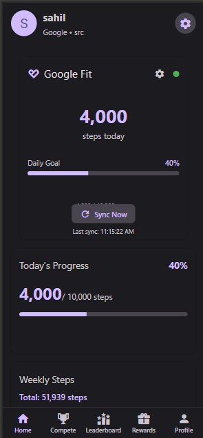 | 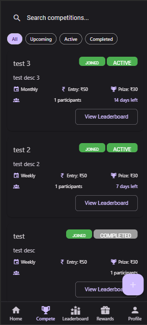 | 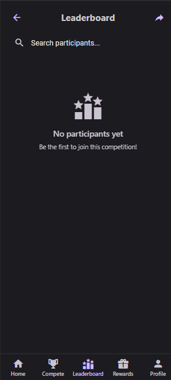 | 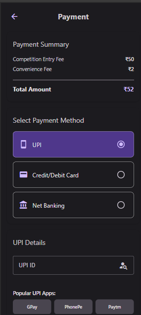 |

### Authentication Flow

| Login Screen | Registration Screen | Google Fit Integration |
|-------------|-------------------|----------------------|
| 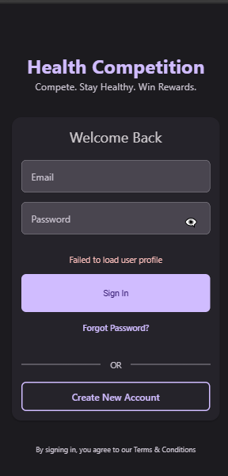 | 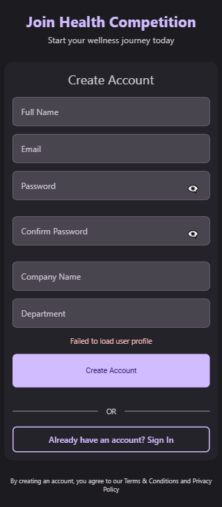 | 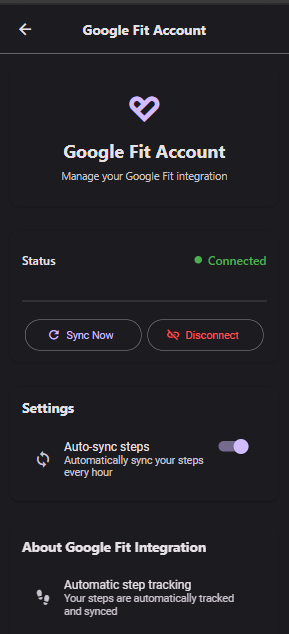 |

### Key Features in Action

| Step Tracking | Competition Details | Prize Distribution | Profile Management |
|--------------|-------------------|-------------------|-------------------|
| 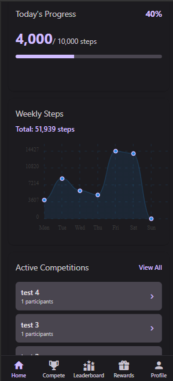 | 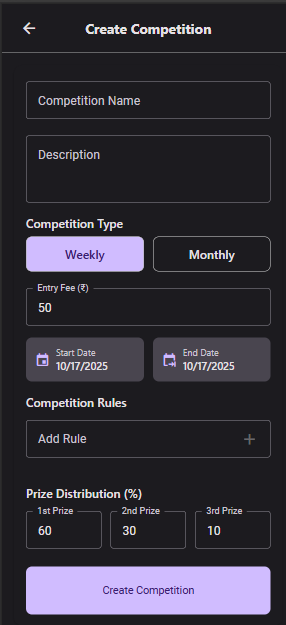 | 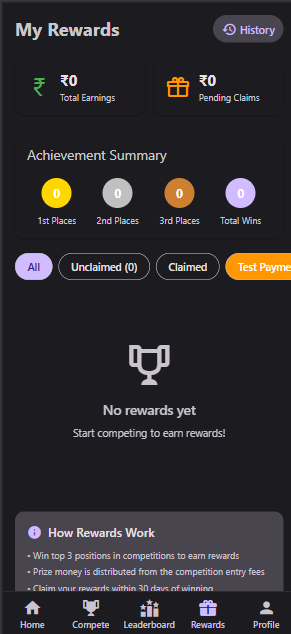 | 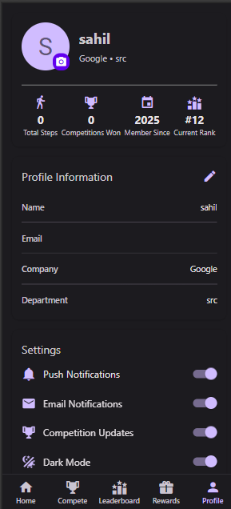 |

*To add your own screenshots:*
1. Run the app using `npm start`
2. Take screenshots of the key screens listed above
3. Save them as PNG files in the `screenshots/` directory
4. Replace the placeholder paths in this README with your actual screenshot files

## 📱 Core Features

### 1. Authentication System
- **Login/Register** with email and password
- Company and department information
- Secure Firebase authentication
- User profile management

### 2. Google Fit Integration
- **Step Tracking**: Automatic daily step count sync
- **Historical Data**: Weekly and monthly step analytics
- **Real-time Updates**: Live step counter with progress
- **Authorization**: Secure OAuth integration

### 3. Competition Management
- **Create Competitions**: Admin can create weekly/monthly competitions
- **Join Competitions**: Employees can join with entry fee payment
- **Competition Types**: Weekly and monthly duration options
- **Prize Distribution**: Automatic prize pool calculation (60% to winners)

### 4. Payment System
- **Multiple Payment Methods**: UPI, Credit/Debit Cards, Net Banking
- **Secure Processing**: Encrypted payment handling
- **Entry Fee Collection**: ₹50 standard fee with convenience charges
- **Payment History**: Transaction records and receipts

### 5. Dashboard & Analytics
- **Daily Progress**: Real-time step tracking with goals
- **Weekly Charts**: Visual step history with line charts
- **Achievement Stats**: Calories, distance, and time tracking
- **Active Competitions**: Quick access to ongoing challenges

### 6. Leaderboard System
- **Real-time Rankings**: Live competition standings
- **Top Three Display**: Special podium visualization
- **Personal Ranking**: Highlight user's current position
- **Filter Options**: Search and filter participants

### 7. Rewards & Prizes
- **Prize Calculation**: Automatic distribution based on position
- **Claim System**: Secure reward claiming process
- **Earnings Tracking**: Total winnings and pending claims
- **Achievement Badges**: Visual representation of wins

### 8. Notifications
- **Push Notifications**: Real-time updates and reminders
- **Competition Alerts**: New competitions and deadline reminders
- **Achievement Notifications**: Milestone celebrations
- **Smart Filtering**: Unread/read notification management

### 9. Profile Management
- **Personal Information**: Editable profile details
- **Statistics Dashboard**: Personal health metrics
- **Settings Management**: Privacy and notification preferences
- **Achievement History**: Competition participation record

## 🏗️ Architecture & Components

### Project Structure
```
src/
├── components/          # Reusable UI components
│   ├── GoogleFitCard.tsx
│   └── NotificationsContainer.tsx
├── context/            # React Context providers
│   ├── AuthContext.tsx
│   ├── CompetitionContext.tsx
│   └── ThemeContext.tsx
├── screens/            # Main app screens
│   ├── Auth/
│   ├── Dashboard/
│   ├── Competition/
│   ├── Profile/
│   ├── Leaderboard/
│   ├── Payment/
│   ├── Rewards/
│   └── Settings/
├── services/           # Business logic and APIs
│   └── GoogleFitService.ts
├── types/              # TypeScript type definitions
│   └── index.ts
└── utils/              # Helper functions
```

### Key Components Explained

#### 1. Authentication Components
- **LoginScreen**: User login with email/password
- **RegisterScreen**: New user registration with company details
- **AuthContext**: Global authentication state management

#### 2. Google Fit Components
- **GoogleFitService**: Complete Google Fit API integration
- **GoogleFitCard**: Real-time step tracking UI component
- Features: Daily steps, weekly progress, goal tracking

#### 3. Competition Components
- **CompetitionScreen**: Browse and join competitions
- **CreateCompetitionScreen**: Admin competition creation
- **CompetitionContext**: Competition state management

#### 4. Dashboard Components
- **DashboardScreen**: Main user dashboard with analytics
- Features: Step charts, active competitions, quick actions
- Real-time data updates and progress tracking

#### 5. Payment Components
- **PaymentScreen**: Multi-method payment processing
- Features: UPI, cards, net banking integration
- Secure transaction handling

#### 6. Leaderboard Components
- **LeaderboardScreen**: Real-time competition rankings
- Features: Top three podium, search/filter, personal ranking
- Animated rank updates and achievement badges

#### 7. Profile Components
- **ProfileScreen**: User profile management
- Features: Edit profile, statistics, settings
- Image upload and privacy controls

#### 8. Rewards Components
- **RewardsScreen**: Prize management and claiming
- Features: Earnings tracking, achievement summary
- Secure reward claiming process

#### 9. Settings Components
- **SettingsScreen**: Comprehensive app settings
- Features: Notifications, privacy, data management
- Account management and support options

## 🔧 Technical Implementation

### State Management
- **React Context**: Global state for auth, competitions, theme
- **Local State**: Component-specific state with useState
- **Async Storage**: Persistent settings and preferences

### Database Schema
```typescript
// User Schema
interface User {
  id: string;
  name: string;
  email: string;
  company: string;
  department: string;
  totalSteps: number;
  competitionsWon: number;
  joinedDate: Date;
}

// Competition Schema
interface Competition {
  id: string;
  name: string;
  description: string;
  type: 'weekly' | 'monthly';
  entryFee: number;
  prizePool: number;
  startDate: Date;
  endDate: Date;
  participants: string[];
  status: 'upcoming' | 'active' | 'completed';
  createdBy: string;
  rules: string[];
  prizes: {
    first: number;
    second: number;
    third: number;
  };
}

// Step Data Schema
interface StepData {
  userId: string;
  competitionId: string;
  date: string;
  steps: number;
  timestamp: Date;
}
```

### API Integration
- **Firebase**: Authentication and Firestore database
- **Google Fit API**: Step tracking and health data
- **Payment Gateway**: Multi-method payment processing
- **Push Notifications**: Real-time user engagement

### Security Features
- **OAuth 2.0**: Secure Google Fit authorization
- **Encrypted Payments**: PCI-compliant payment processing
- **Data Privacy**: User consent and privacy controls
- **Secure Authentication**: Firebase security rules

## 🚀 Getting Started

### Prerequisites
- React Native development environment
- Firebase project setup
- Google Fit API credentials
- Payment gateway integration

### Installation
```bash
# Clone the repository
git clone <repository-url>

# Install dependencies
npm install

# iOS setup
cd ios && pod install

# Run the app
npm run android  # or npm run ios
```

### Configuration
1. **Firebase Setup**:
   - Create Firebase project
   - Configure Authentication
   - Set up Firestore database
   - Add Firebase config to app

2. **Google Fit Setup**:
   - Enable Google Fit API in Google Cloud Console
   - Configure OAuth credentials
   - Add SHA-1 fingerprint

3. **Payment Gateway**:
   - Set up payment provider account
   - Configure API keys
   - Test payment methods

## 💰 Monetization & Business Model

### Revenue Streams
1. **Entry Fees**: ₹50 per competition per participant
2. **Convenience Fees**: ₹2 per transaction
3. **Premium Features**: Advanced analytics and personal training
4. **Corporate Plans**: Company-wide wellness programs

### Prize Distribution
- **First Place**: 60% of prize pool
- **Second Place**: 30% of prize pool  
- **Third Place**: 10% of prize pool
- **Platform Fee**: Remaining amount for platform maintenance

### Example Calculation
For a competition with 100 participants:
- Total Collection: ₹5,000 (₹50 × 100)
- Prize Pool: ₹3,000 (60% distribution)
  - 1st Place: ₹1,800
  - 2nd Place: ₹900
  - 3rd Place: ₹300
- Platform Revenue: ₹2,000

## 🎯 User Journey

### New User Flow
1. **Registration**: Sign up with company details
2. **Profile Setup**: Complete personal information
3. **Google Fit Connect**: Authorize step tracking
4. **Browse Competitions**: View available challenges
5. **Join Competition**: Pay entry fee and participate
6. **Track Progress**: Monitor daily steps and ranking
7. **Win Prizes**: Claim rewards for top positions

### Admin Flow
1. **Create Competition**: Set up new challenges
2. **Manage Participants**: Monitor join requests
3. **Track Progress**: View competition analytics
4. **Distribute Prizes**: Process winner payments
5. **Generate Reports**: Export competition data

## 🔮 Future Enhancements

### Planned Features
1. **Multi-Device Support**: Wear OS and iOS integration
2. **Advanced Analytics**: AI-powered health insights
3. **Social Features**: Team competitions and challenges
4. **Corporate Dashboard**: Company-wide wellness metrics
5. **Integration Partners**: Health apps and wearable devices

### Scalability Considerations
- **Cloud Infrastructure**: Auto-scaling backend services
- **Data Analytics**: Real-time competition metrics
- **Machine Learning**: Personalized health recommendations
- **Global Expansion**: Multi-language and currency support

## 📄 License & Legal

This project is licensed under the MIT License. See LICENSE file for details.

### Compliance
- **GDPR Compliant**: Data protection and privacy
- **HIPAA Compliant**: Health data security
- **PCI DSS**: Payment card industry standards
- **Accessibility**: WCAG 2.1 compliance

## 🤝 Contributing

We welcome contributions! Please see CONTRIBUTING.md for guidelines.

### Development Guidelines
- Follow React Native best practices
- Write comprehensive tests
- Maintain code quality standards
- Document new features

---

**Built with ❤️ for promoting workplace wellness and healthy competition**